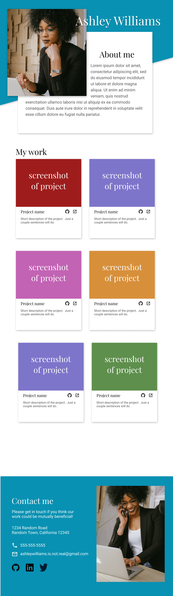

# odin-advanced-html-and-css

## description:

This is a fake portfolio for practicing accessibility and responsiveness. As the project is pretty simple, I made it with vanilla `HTML` and `CSS`, and no module bundler as the only piece of code is a few lines for cloning the cards.

## live: https://hectorvilas.github.io/odin-advanced-html-and-css/

## preview images:

### on desktop:

  
Reference

  

  
My work

  

---

### on tablet

  
Reference

  

  
My work

  

---

### on mobile

  
Reference

  

  
My work

  

